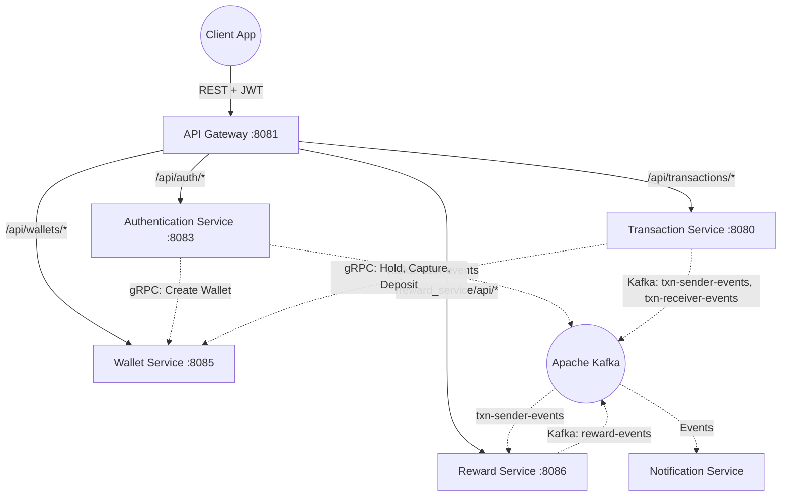
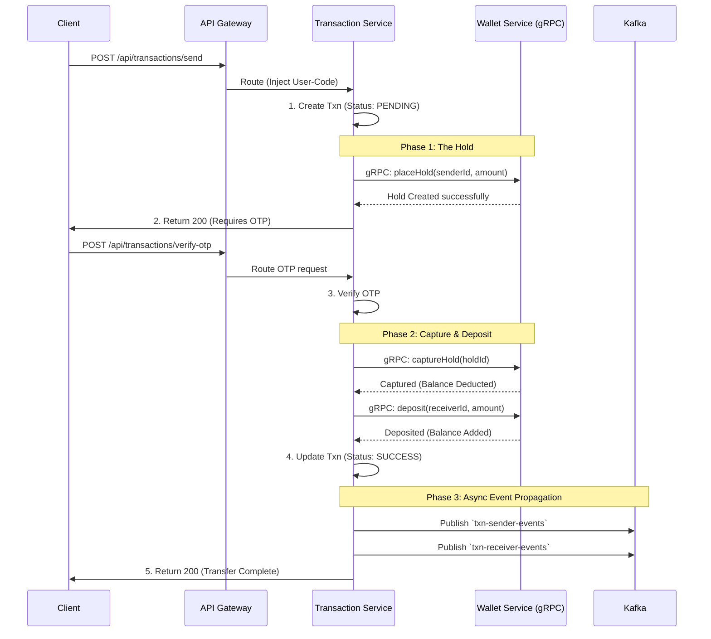

<div align="center">
  
# 🌐 Central Payment Ecosystem 
**High-Concurrency Distributed Microservices Architecture**

*(You are currently viewing the **Transaction Service**, the core engine of the Central ecosystem)*

</div>

---

## 📖 Introduction 
Welcome! If you are reviewing this project as part of my portfolio, **this is the best place to start**. 

The **Central Payment Ecosystem** is a distributed, high-throughput microservices application designed to mimic a real-world digital wallet and payment gateway (like PayPal or Venmo). It is built to handle complex distributed transactions, prevent double-spending, and asynchronously process downstream events without blocking the user's critical payment path.

While this repository houses the **Transaction Service**, the entire ecosystem consists of five independent microservices working in concert. 

### 🔗 The Ecosystem Repositories
1. 🛡️ **[API Gateway](https://github.com/sarvesh873/101_Central_API-Gateway)**: The edge server. Handles JWT validation, rate limiting, and request routing.
2. 👤 **[Authentication Service](https://github.com/sarvesh873/101_Central_Authentication-Service)**: Manages user onboarding, password hashing, and token generation.
3. 🏦 **[Wallet Service](https://github.com/sarvesh873/101_Central_Wallet-Service)**: The financial ledger. Exposes highly optimized gRPC endpoints for balance management.
4. 💸 **[Transaction Service (Current Repo)](https://github.com/sarvesh873/101_Central_Transaction-Service)**: The orchestrator of money movement, implementing Two-Phase Commit logic.
5. 🎁 **[Reward Service](https://github.com/sarvesh873/101_Central_Reward-Service)**: An event-driven service that awards users points/cashback based on transaction history.

---

## 🏗️ End-to-End System Architecture

The architecture blends **synchronous gRPC communication** for operations requiring strict consistency (like deducting funds) and **asynchronous Kafka messaging** for operations that can be eventually consistent (like sending a push notification).



### Microservice Roles Explained:
- **API Gateway**: All external traffic hits here. It intercepts the request, validates the JWT, and extracts the user's identity, injecting an `X-User-Code` header before proxying the request internally. This ensures internal services don't have to duplicate authentication logic.
- **Auth Service**: When a user registers, this service saves their credentials and makes a **synchronous gRPC call** to the Wallet Service to provision their wallet immediately.
- **Transaction Service**: The core orchestrator (detailed heavily below).
- **Wallet Service**: The source of truth for money. It uses **optimistic locking** in PostgreSQL to prevent race conditions during concurrent balance updates.
- **Reward & Notification Services**: Completely decoupled from the payment path. They listen to Kafka topics (`txn-sender-events`) and react only after a payment is successfully finalized.

---

## 💎 The Crown Jewel: The "Hold & Capture" Transaction Flow

Moving money in a distributed system is hard. If a user tries to send money, and the system deducts their balance but fails to credit the receiver, money is lost. To guarantee **ACID properties across multiple microservices**, the Transaction Service implements a **Two-Phase Commit (2PC) / Hold-and-Capture** pattern over gRPC.

### The Sequence



### Step-by-Step Breakdown:
1. **Initiation**: The user initiates a transfer. The Transaction Service creates a record in its database with a `PENDING` state.
2. **Phase 1 (The Hold)**: The Transaction Service makes a fast gRPC call to the Wallet Service to place a "hold" on the specific amount. The Wallet Service locks those funds, meaning the sender cannot double-spend them while the transaction is pending.
3. **Verification**: The system pauses and waits for the user to provide an OTP (Multi-Factor Authentication). 
4. **Phase 2 (Capture & Deposit)**: Once the OTP is verified, the Transaction Service issues a gRPC command to the Wallet to *capture* (permanently deduct) the held funds, followed immediately by a gRPC command to *deposit* those funds into the receiver's wallet.
5. **Phase 3 (Event Generation)**: The transaction is marked `SUCCESS`. Kafka events are fired off so the Reward Service can calculate cashback, and the Notification Service can email the users.

---

## 🛠️ Key Engineering Decisions & Trade-offs

- **Why gRPC for the Wallet Service?** 
  Financial transactions require strict consistency and the lowest possible latency. HTTP/REST introduces too much overhead for internal microservice chatter. By using gRPC (HTTP/2 + Protobuf), the Transaction service can execute the `placeHold`, `captureHold`, and `deposit` steps in single-digit milliseconds.
  
- **Why Kafka for Rewards and Notifications?**
  A user shouldn't have to wait for an email to be sent or a cashback rule to be calculated before their screen shows "Payment Successful." By pushing these to Kafka, the critical payment path remains lightning fast, and downstream services can process events at their own pace (or retry them if they fail).

- **How is Double-Spending Prevented?**
  By using the "Hold" mechanism combined with **Optimistic Locking** (`@Version` in JPA/Hibernate) in the Wallet Service. If two concurrent requests attempt to modify the same wallet balance, the database will reject the second one, preventing a race condition.

---

## 💻 Tech Stack Highlights
- **Language**: Java 21 (Utilizing Virtual Threads for high-concurrency I/O bound tasks)
- **Framework**: Spring Boot 3.x, Spring Cloud Gateway
- **RPC & Messaging**: gRPC, Protocol Buffers, Apache Kafka
- **Resilience**: Resilience4j (Circuit Breakers)
- **Data**: PostgreSQL (Hibernate/JPA), Redis (Rate Limiting in Gateway)
- **Observability**: Prometheus & Actuator metrics

---

## 🚀 Running the Ecosystem Locally

If you'd like to spin up the ecosystem yourself, you will need **Docker** installed.

1. **Start the Infrastructure (Database, Kafka, Zookeeper)**
   *(A `docker-compose.yml` is provided in the root to easily spin up the backing services).*
   ```bash
   docker-compose up -d
   ```
2. **Start the Microservices**
   Clone the 5 repositories. In each one, run:
   ```bash
   mvn clean install
   mvn spring-boot:run
   ```
   *Note: Ensure you start the Wallet Service before the Transaction/Auth services, as they require its gRPC server to be active on startup.*

3. **Access the API Documentation**
   Each service exposes a Swagger UI for its REST endpoints.
   - Transaction Service Swagger: `http://localhost:8080/swagger-ui.html`
   - Gateway acts on port `8081`.


## 📚 API Documentation

Once the application is running, access the following:

- **Swagger UI**: http://localhost:8080/swagger-ui.html
- **OpenAPI 3.0 Docs**: http://localhost:8080/v3/api-docs

## 🧪 Testing

Run the test suite with coverage:

```bash
mvn clean test jacoco:report
```

## 🚀 Deployment upcoming

### Kubernetes

```bash
kubectl apply -f k8s/
```

### Helm

```bash
helm install transaction-service ./charts/transaction-service
```

## 🛡️ Security

- Idempotency Keys to prevent replay attacks
- Input validation
- Internal network isolation (gRPC over private subnet)
- Rate limiting via Gateway

## 📈 Monitoring

The service exposes Prometheus metrics at `/actuator/prometheus` and includes:

- Request/response metrics
- JVM metrics
- Database connection pool metrics
- Transaction success/failure rates

## 🤝 Contributing

1. Fork the repository
2. Create your feature branch (`git checkout -b feature/AmazingFeature`)
3. Commit your changes (`git commit -m 'Add some AmazingFeature'`)
4. Push to the branch (`git push origin feature/AmazingFeature`)
5. Open a Pull Request
